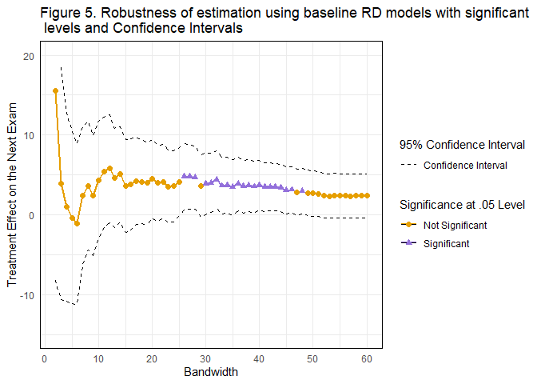

Regression Discontinuity
================
SX and EJT

## Loading packages

``` r
library(MASS)
library(leaps)
library(ggplot2)
library(readr)
library(readxl)
library(dplyr)
library(tidyr)
library(RColorBrewer)
library(stringr)
library(magrittr)
library(lme4)
library(AICcmodavg)
library(broom)
library(broom.mixed)
library(RCurl)
library(modelsummary)
library(rdrobust)
library(rddensity)
```

## 1. Loading the example datafile

Before running the RD analysis, we can load example data from GitHub and
center the running variable. In the example data, the running variable
is named as *Running* and the intervention status is indicated by a
binary variable, *Reachout*.

``` r
# Load the sample data from GitHub
Data_comp <- read.csv(text=getURL("https://raw.githubusercontent.com/TheobaldLab/RegressionDiscontinuity/refs/heads/main/RD_WrokingData.csv"))

# Centering the running variable at 71.5 points for regression analysis
Data_comp <- Data_comp %>%
  mutate(c_running = Running - 71.5)
```

We should note that for the privacy purpose, we removed all identifiable
information.

## 2. Checking threshold and sharpness

In Section *Setting up an RD design: A pre-determined threshold*, we
described two assumptions that help set up the RD study. First of all,
we can check the number of non-compilers

``` r
# check number of non-compilers
Data_comp <- Data_comp %>%
mutate(
  Below = case_when(
    Running >=71.5 ~ "0",
    Running < 71.5 ~ "1",
    TRUE ~ "NA"
  )
)
Data_comp <- Data_comp %>%
  mutate(
    Compliance = case_when(
      Below == 1 & Reachout == 1 ~ "1",
      Below == 0 & Reachout == 0 ~ "1",
      Below == 1 & Reachout == 0 ~ "0",
      Below == 0 & Reachout == 1 ~ "0",
      TRUE ~ "NA"
    )
  )
table(Data_comp$Compliance)
```

    ## 
    ##    1 
    ## 3062

Out of 3063 participated students, there was only one non-compiler,
indicating that a sharp RD can be used. Second, we can visually examine
the continuity of the running variable, in particular around the
threshold (Figure 2 in the paper).

``` r
# Create Figure 2 
Data_comp %>%
  ggplot(aes(x = Running, y = Reachout, color = as.factor(Reachout)))+
  geom_point(size = 1.5, alpha = 0.5, position = position_jitter(width = 0, height = 0.25, seed = 1234))+ ggtitle("Figure 2 Visualization of clearly-defined threshold of intervention \n assignment along a continuous running variable")+
  geom_vline(xintercept = 71.5) + xlim(40,100)+ #limit the range of x for a better visualization
  scale_color_manual(values=c("mediumpurple", "#E69F00"),  labels = c("No", "Yes")) +
  theme(
    panel.border = element_rect(fill = "transparent"),
    panel.background = element_rect(fill = "transparent"),
    panel.grid = element_blank(),
    legend.key = element_rect(fill = "transparent", color = NA)
    )+
  labs(x = "Cumulative Grade Before Reaching Out", y = "Reaching Out Status", color = "Reached Out")+
  scale_y_continuous(breaks = seq(0,1, by = 1))
```

<!-- -->

## 3. Setting a comparable condition through bandwidth selection

In the paper, we presented two approaches that examined bandwidth.
First, we created scatter plots of the learning outcome (the next exam
scores) against centered running variable, and narrowed bandwidths
(Figure 3 in the paper).

For example, a scatter plot with a bandwidth of 30 points can be
generated by the following codes

``` r
# Figure 3c
Data_comp %>%
  ggplot(aes(x = c_running, y = Next, color = as.factor(Reachout)))+
  ggtitle ("Figure 3 Creating comparable samples by narrowing samples \n around threshold (Figure 3c in the paper)")+
  geom_point(size = 1.5, alpha = 0.5) +
  geom_vline(xintercept = 0) +
  scale_x_continuous(breaks = seq(-20, 20, by = 5))+
  scale_y_continuous(breaks = seq(30, 100, by = 5))+
  xlim(-15, 15)+ # readers can change the bandwidth by changing the coefficients
  ylim(30,100)+ 
  scale_color_manual(values=c("mediumpurple", "#E69F00"),  labels = c("No", "Yes"))+
  labs(x = "Centered Cumulative Grade Before Reaching Out", y = "Next Exam", color = "Reached Out") +
  theme(
    panel.border = element_rect(fill = "transparent"),
    panel.background = element_rect(fill = "transparent"),
    panel.grid = element_blank(),
    legend.key = element_rect(fill = "transparent", color = NA)
  )
```

<!-- -->

Next, we checked the covariate balance (Table 1 in the paper) by
estimating each key covariate (i.e., first generation status, gender,
and racial minority status) using reaching out status. For example, the
codes below examine the balance of *first generation status* by
bandwidths (full sample, 40 points, and 30 points).

``` r
# Full sample
full <- lm(Firstgen ~ Reachout, data = Data_comp)
summary(full)
```

    ## 
    ## Call:
    ## lm(formula = Firstgen ~ Reachout, data = Data_comp)
    ## 
    ## Residuals:
    ##     Min      1Q  Median      3Q     Max 
    ## -0.3227 -0.3227 -0.3227  0.6773  0.7423 
    ## 
    ## Coefficients:
    ##              Estimate Std. Error t value Pr(>|t|)    
    ## (Intercept)  0.322737   0.008972  35.970  < 2e-16 ***
    ## Reachout    -0.065006   0.025205  -2.579  0.00995 ** 
    ## ---
    ## Signif. codes:  0 '***' 0.001 '**' 0.01 '*' 0.05 '.' 0.1 ' ' 1
    ## 
    ## Residual standard error: 0.464 on 3060 degrees of freedom
    ## Multiple R-squared:  0.002169,   Adjusted R-squared:  0.001843 
    ## F-statistic: 6.651 on 1 and 3060 DF,  p-value: 0.009954

``` r
# Bandwidth of 40 points
band_40 <- lm(Firstgen ~ Reachout, data = filter(Data_comp, c_running>= -20 & c_running <=20))
summary(band_40)
```

    ## 
    ## Call:
    ## lm(formula = Firstgen ~ Reachout, data = filter(Data_comp, c_running >= 
    ##     -20 & c_running <= 20))
    ## 
    ## Residuals:
    ##     Min      1Q  Median      3Q     Max 
    ## -0.3151 -0.3151 -0.3151  0.6849  0.7283 
    ## 
    ## Coefficients:
    ##             Estimate Std. Error t value Pr(>|t|)    
    ## (Intercept)  0.31514    0.01024  30.767   <2e-16 ***
    ## Reachout    -0.04347    0.02686  -1.618    0.106    
    ## ---
    ## Signif. codes:  0 '***' 0.001 '**' 0.01 '*' 0.05 '.' 0.1 ' ' 1
    ## 
    ## Residual standard error: 0.4619 on 2378 degrees of freedom
    ## Multiple R-squared:  0.0011, Adjusted R-squared:  0.0006797 
    ## F-statistic: 2.618 on 1 and 2378 DF,  p-value: 0.1058

``` r
# Bandwidth of 30 points
band_30 <- lm(Firstgen ~ Reachout, data = filter(Data_comp, c_running>= -15 & c_running <=15))
summary(band_30)
```

    ## 
    ## Call:
    ## lm(formula = Firstgen ~ Reachout, data = filter(Data_comp, c_running >= 
    ##     -15 & c_running <= 15))
    ## 
    ## Residuals:
    ##     Min      1Q  Median      3Q     Max 
    ## -0.2799 -0.2786 -0.2786  0.7201  0.7214 
    ## 
    ## Coefficients:
    ##             Estimate Std. Error t value Pr(>|t|)    
    ## (Intercept) 0.278560   0.012551  22.194   <2e-16 ***
    ## Reachout    0.001314   0.028119   0.047    0.963    
    ## ---
    ## Signif. codes:  0 '***' 0.001 '**' 0.01 '*' 0.05 '.' 0.1 ' ' 1
    ## 
    ## Residual standard error: 0.4487 on 1594 degrees of freedom
    ## Multiple R-squared:  1.37e-06,   Adjusted R-squared:  -0.000626 
    ## F-statistic: 0.002184 on 1 and 1594 DF,  p-value: 0.9627

To understand the covariate balance, we are looking at the estimations
of **Reachout** on first generation status and their significant levels.
At the full sample, the estimation is -0.065 and significant at 0.01
level, whereas at bandwidths of 40 and 30 points, both estimations are
not significant. Please see Table 1 in the paper for more covariate
balance checking information. In the paper, we also relied on automated
bandwidth selection results to perform subsequent analyses. The codes
can be found below,

``` r
# automated bandwidth selection
rdbwselect(y = Data_comp$Next, x = Data_comp$Running, c = 71.5, all = TRUE) %>%
  summary()
```

    ## Call: rdbwselect
    ## 
    ## Number of Obs.                 3062
    ## BW type                         All
    ## Kernel                   Triangular
    ## VCE method                       NN
    ## 
    ## Number of Obs.                  388         2674
    ## Order est. (p)                    1            1
    ## Order bias  (q)                   2            2
    ## Unique Obs.                     306         1382
    ## 
    ## =======================================================
    ##                   BW est. (h)    BW bias (b)
    ##             Left of c Right of c  Left of c Right of c
    ## =======================================================
    ##      mserd    11.867     11.867     21.033     21.033
    ##     msetwo    10.030     13.105     19.407     18.171
    ##     msesum    10.939     10.939     19.270     19.270
    ##   msecomb1    10.939     10.939     19.270     19.270
    ##   msecomb2    10.939     11.867     19.407     19.270
    ##      cerrd     7.944      7.944     21.033     21.033
    ##     certwo     6.714      8.773     19.407     18.171
    ##     cersum     7.323      7.323     19.270     19.270
    ##   cercomb1     7.323      7.323     19.270     19.270
    ##   cercomb2     7.323      7.944     19.407     19.270
    ## =======================================================

We relied on MSE category to find the range of optimal bandwidths. Note:
the estimated bandwidth shown here might be slightly different than the
selected BW in the paper.

## 4.Baseline RD model

In the paper, we demonstrated the baseline RD model in the forms of
visualization (Figure 4) and model estimation results (Table 2) and
utilized the baseline model to increase the robustness (Figure 5). The
codes below explain each step. Additionally, in SI, we provided the
visualizaiton of the parametric estimation.

First we create the visualization shown in Figure 4.

``` r
# Figure 4
Data_comp %>%
  ggplot(aes(x = c_running, y = Next, color = as.factor(Reachout)))+
  ggtitle("Figure 4. Visualization of baseline Regression Discontinuity (RD) \n estimation (Bandwidth = 26 points, n = 1335)") +
  geom_point(size = 1.5, alpha = 0.5) +
  geom_smooth(data = filter(Data_comp, Running <= 71.5 & Reachout == 1), method = "lm", se = F)+ #adding fitted line for treated students
  geom_smooth(data = filter(Data_comp, Running > 71.5 & Reachout == 0), method = "lm", se = F)+ #adding fitted lien for untreated students
  geom_vline(xintercept = 0) +
  scale_x_continuous(breaks = seq(-20, 20, by = 5))+
  scale_y_continuous(breaks = seq(40, 100, by = 10), limits = c(40, 100))+
  xlim(-13, 13)+ #limit the sample to a bandwidth of 26 points
  scale_color_manual(values=c("mediumpurple", "#E69F00"),  labels = c("No", "Yes"))+
  labs(x = "Centered Cumulative Grade Before Reaching Out", y = "Next Exam", color = "Reached Out")+
  theme(
    panel.border = element_rect(fill = "transparent"),
    panel.background = element_rect(fill = "transparent"),
    panel.grid = element_blank(),
    legend.key = element_rect(fill = "transparent", color = NA)
  )
```

<!-- -->

Second, following Equation (1) in the paper, we can run the RD model and
get coefficients in Table 2. The codes below generate the baseline RD
model estimation, using a bandwidth of 30 points as an example.

``` r
baseline_30 <- lm(Next ~ Reachout + c_running, data = filter(Data_comp, c_running>= -15 & c_running <=15)) #change the range for different bandwidths
summary(baseline_30)
```

    ## 
    ## Call:
    ## lm(formula = Next ~ Reachout + c_running, data = filter(Data_comp, 
    ##     c_running >= -15 & c_running <= 15))
    ## 
    ## Residuals:
    ##     Min      1Q  Median      3Q     Max 
    ## -76.711  -7.581   3.250  11.608  41.309 
    ## 
    ## Coefficients:
    ##             Estimate Std. Error t value Pr(>|t|)    
    ## (Intercept)  58.4601     1.1358  51.470   <2e-16 ***
    ## Reachout      3.8846     1.9607   1.981   0.0477 *  
    ## c_running     1.2441     0.1125  11.060   <2e-16 ***
    ## ---
    ## Signif. codes:  0 '***' 0.001 '**' 0.01 '*' 0.05 '.' 0.1 ' ' 1
    ## 
    ## Residual standard error: 17.96 on 1593 degrees of freedom
    ## Multiple R-squared:  0.1468, Adjusted R-squared:  0.1458 
    ## F-statistic: 137.1 on 2 and 1593 DF,  p-value: < 2.2e-16

As shown in the model summary, at a bandwidth of 30 points, the
estimated effect of reaching out is 3.88 points and is significant at
the 0.05 level.

Finally, using the baseline RD model specification, we can go through
bandwidths from 2 points to 60 points to search for optimal bandwidth.
The codes below create Figure 5 in the paper.

``` r
# Figure 5
results <- data.frame(Bandwidth = integer(),  #create a blank data frame to store regression results 
                      Treatment_Effect = numeric(), 
                      CI_Lower = numeric(), 
                      CI_Upper = numeric(), 
                      p_value = numeric())

for (bw in seq(1,30, by = 0.5)) {   #loop through bandwidths from 2 to 60, with the increment of 1 point
  subset_data <- subset(Data_comp, abs(c_running) <= bw) #create sub-sample with the current bandwidth
  model <- lm(Next ~ Reachout + c_running, data = subset_data)  #run the RD model
  treatment_effect <- coef(model)["Reachout"]  #extract related information
  conf_int <- confint(model, "Reachout", level = 0.95)
  p_value <- tidy(model) %>% filter(term == "Reachout") %>% pull(p.value)
  results <- rbind(results,   #store the bandwidth, coefficients, and p-values
                   data.frame(Bandwidth = bw*2, 
                              Treatment_Effect = treatment_effect, 
                              CI_Lower = conf_int[1], 
                              CI_Upper = conf_int[2], 
                              p_value = p_value))
}

results <- results %>%  #add a set of new results each time after each run
  mutate(Significance = ifelse(p_value < 0.05, "Significant", "Not Significant"))

results <- results %>%  #indicate sig/non-sig results
  mutate(Group = cumsum(Significance != lag(Significance, default = first(Significance))))

plot_next <-  ggplot(results, aes(x = Bandwidth, y = Treatment_Effect, color = Significance)) +
  geom_line(aes(group = Group), size = 1) +  
  geom_line(aes(y = CI_Lower, linetype = "Confidence Interval"), color = "black", show.legend = TRUE) +
  geom_line(aes(y = CI_Upper, linetype = "Confidence Interval"), color = "black", show.legend = TRUE) +
  geom_point(aes(shape = Significance), size = 2) +  # Points to indicate significance
  scale_color_manual(values = c("Significant" = "mediumpurple", "Not Significant" = "#E69F00")) +
  ggtitle ("Figure 5. Bandwidth selection using baseline RD models \n with significant levels and Confidence Intervals") +
  scale_linetype_manual(name = "Legend", values = c("Confidence Interval" = "dashed")) +
  labs(x = "Bandwidth",
       y = "Treatment Effect on the Next Exam") +
  theme_minimal() +
  guides(
    color = guide_legend(title = "Significance at .05 Level"),
    linetype = guide_legend(title = "95% Confidence Interval"),
    shape = guide_legend(title = "Significance at .05 Level")
  ) +
  theme(
    panel.border = element_rect(fill = "transparent"),
    panel.background = element_rect(fill = "transparent"),
  ) +
  scale_y_continuous(breaks = seq(-10,20, by = 1)) + ylim(-15,20) +
  scale_x_continuous(breaks = seq(0,60, by = 10))
 
plot_next
```

<!-- -->

Please see the paper for full interpretation of Figure 5.

In the SI, we used the codes below to visually examine parametric
estimation.

``` r
rdplot(y = Data_comp$Next, x = Data_comp$Running, c = 71.5, x.lim = c(58.5,84.5), y.lim = c(40,80), x.label = "Running", y.label = "Next Exam", title = "")
```

    ## [1] "Mass points detected in the running variable."

<!-- -->

## 5. Fixed-effect model in RD framework

Fixed-effect models are useful to test additional hypotheses under an RD
analysis. In the paper, we added the interaction terms between each
demographic characteristic and reaching out status as fixed effects
(Table 3 in the paper). The codes below generate model estimation with
the interaction term between first generation status and reaching out
status.

``` r
# Table 3, Model 2
First_26 <- lm(Next ~ Reachout*Firstgen + c_running, data = filter(Data_comp, c_running>= -13 & c_running <=13))
summary(First_26)
```

    ## 
    ## Call:
    ## lm(formula = Next ~ Reachout * Firstgen + c_running, data = filter(Data_comp, 
    ##     c_running >= -13 & c_running <= 13))
    ## 
    ## Residuals:
    ##     Min      1Q  Median      3Q     Max 
    ## -74.562  -7.832   3.021  11.834  39.049 
    ## 
    ## Coefficients:
    ##                   Estimate Std. Error t value Pr(>|t|)    
    ## (Intercept)        57.5137     1.2912  44.541   <2e-16 ***
    ## Reachout            4.8488     2.2569   2.148   0.0319 *  
    ## Firstgen            1.6235     1.2826   1.266   0.2058    
    ## c_running           1.3355     0.1409   9.481   <2e-16 ***
    ## Reachout:Firstgen  -0.3280     2.6419  -0.124   0.9012    
    ## ---
    ## Signif. codes:  0 '***' 0.001 '**' 0.01 '*' 0.05 '.' 0.1 ' ' 1
    ## 
    ## Residual standard error: 18.11 on 1331 degrees of freedom
    ## Multiple R-squared:  0.1279, Adjusted R-squared:  0.1252 
    ## F-statistic: 48.78 on 4 and 1331 DF,  p-value: < 2.2e-16

The focal coefficient that we are looking at is **Reaching:Firstgen**,
indicating the interaction term between first generation status and
reaching out status. The estimate is -0.328 and not significant.

## 6. Sensitivity analyses

In the paper, we demonstrated three sets of sensitivity analyses that
were critical in strengthening the internal validity.

First, we can visually check whether there are any other discontinuities
at hypothetical thresholds. For example, codes below can create Figure 6
in the paper.

``` r
# Figure 6
Data_comp <- Data_comp %>%  #create a fake cutoff at 85 points. Readers may select multiple cutoff points other than the real cutoff.
  mutate(
    fake_cutoff = case_when(
      Running >=85 ~ "0",
      Running < 85 ~ "1",
      TRUE ~ "NA"
    )
  )

Data_comp %>%
  ggplot(aes(x = Running, y = Next, color = as.factor(fake_cutoff)))+
  ggtitle("Figure 6. Sensitivity analysis: Placebo test using a hypothetical \n reach-out point at 85 points (Bandwidth = 26 points). ") +
  geom_point(size = 1.5, alpha = 0.5) +
  geom_smooth(data = filter(Data_comp, Running >=85), method = "lm", se = F)+
  geom_smooth(data = filter(Data_comp, Running < 85), method = "lm", se = F)+
  geom_vline(xintercept = 85) +
  scale_x_continuous(breaks = seq(70, 100, by = 5))+
  scale_y_continuous(breaks = seq(30, 100, by = 5))+
  xlim(72,98)+ ylim(30,100)+ scale_color_manual(values=c("mediumpurple", "#E69F00"))+
  labs(x = "Cumulative Grade Before Reaching Out", y = "Next Exam", color = "Hypothetical Reachout")+
  theme(
    panel.border = element_rect(fill = "transparent"),
    panel.background = element_rect(fill = "transparent"),
    panel.grid = element_blank(),
    legend.key = element_rect(fill = "transparent", color = NA)
  )
```

<!-- -->

Second, we can run models with random effects to consider nested
structure in the example data. In the paper, we consider two different
structures of random effects, the instructor random effect and the
section-TA random effect. For example, codes below can run the
multilevel model with instructor ID, Section, and Section-TA combination
as random intercepts.

``` r
# Instructor ID as random intercepts
model_re1<- lmer(Next ~ Reachout + c_running + (1 | Instructor), data = filter(Data_comp, c_running>= -13 & c_running <=13))
summary (model_re1)
```

    ## Linear mixed model fit by REML ['lmerMod']
    ## Formula: Next ~ Reachout + c_running + (1 | Instructor)
    ##    Data: filter(Data_comp, c_running >= -13 & c_running <= 13)
    ## 
    ## REML criterion at convergence: 11498.5
    ## 
    ## Scaled residuals: 
    ##     Min      1Q  Median      3Q     Max 
    ## -4.2374 -0.4433  0.1580  0.6553  2.1154 
    ## 
    ## Random effects:
    ##  Groups     Name        Variance Std.Dev.
    ##  Instructor (Intercept)  17.09    4.134  
    ##  Residual               320.12   17.892  
    ## Number of obs: 1336, groups:  Instructor, 2
    ## 
    ## Fixed effects:
    ##             Estimate Std. Error t value
    ## (Intercept)  56.6765     3.1786  17.831
    ## Reachout      5.5435     2.1148   2.621
    ## c_running     1.4687     0.1411  10.409
    ## 
    ## Correlation of Fixed Effects:
    ##           (Intr) Reacht
    ## Reachout  -0.337       
    ## c_running -0.351  0.830

``` r
# Section ID as random intercepts
model_re2<- lmer(Next ~ Reachout + c_running + (1 | Section), data = filter(Data_comp, c_running>= -13 & c_running <=13))
summary (model_re2)
```

    ## Linear mixed model fit by REML ['lmerMod']
    ## Formula: Next ~ Reachout + c_running + (1 | Section)
    ##    Data: filter(Data_comp, c_running >= -13 & c_running <= 13)
    ## 
    ## REML criterion at convergence: 11421.8
    ## 
    ## Scaled residuals: 
    ##     Min      1Q  Median      3Q     Max 
    ## -4.5765 -0.4013  0.1489  0.6360  2.0382 
    ## 
    ## Random effects:
    ##  Groups   Name        Variance Std.Dev.
    ##  Section  (Intercept)  43.53    6.598  
    ##  Residual             301.22   17.356  
    ## Number of obs: 1336, groups:  Section, 3
    ## 
    ## Fixed effects:
    ##             Estimate Std. Error t value
    ## (Intercept)  55.3151     4.0030  13.818
    ## Reachout      4.5931     2.0586   2.231
    ## c_running     1.3816     0.1371  10.081
    ## 
    ## Correlation of Fixed Effects:
    ##           (Intr) Reacht
    ## Reachout  -0.260       
    ## c_running -0.271  0.833

``` r
# Section - TA combined ID as random intercepts
model_re3<- lmer(Next ~ Reachout + c_running + (1 | Section_TA), data = filter(Data_comp, c_running>= -13 & c_running <=13))
summary (model_re3)
```

    ## Linear mixed model fit by REML ['lmerMod']
    ## Formula: Next ~ Reachout + c_running + (1 | Section_TA)
    ##    Data: filter(Data_comp, c_running >= -13 & c_running <= 13)
    ## 
    ## REML criterion at convergence: 11428.2
    ## 
    ## Scaled residuals: 
    ##     Min      1Q  Median      3Q     Max 
    ## -4.7423 -0.3950  0.1542  0.6106  1.9176 
    ## 
    ## Random effects:
    ##  Groups     Name        Variance Std.Dev.
    ##  Section_TA (Intercept)  40.83    6.39   
    ##  Residual               287.04   16.94   
    ## Number of obs: 1336, groups:  Section_TA, 56
    ## 
    ## Fixed effects:
    ##             Estimate Std. Error t value
    ## (Intercept)  56.7908     1.4757  38.483
    ## Reachout      4.6338     2.0313   2.281
    ## c_running     1.4468     0.1345  10.758
    ## 
    ## Correlation of Fixed Effects:
    ##           (Intr) Reacht
    ## Reachout  -0.696       
    ## c_running -0.725  0.830

Additionally, in the Supp. material, we present model selection for
three multilevel models with different random intercept structures.

``` r
modelsummary(list(model_re1, model_re2, model_re3))
```

<table style="width:81%;">
<colgroup>
<col style="width: 38%" />
<col style="width: 13%" />
<col style="width: 13%" />
<col style="width: 13%" />
</colgroup>
<thead>
<tr class="header">
<th></th>
<th><ol type="1">
<li></li>
</ol></th>
<th><ol start="2" type="1">
<li></li>
</ol></th>
<th><ol start="3" type="1">
<li></li>
</ol></th>
</tr>
</thead>
<tbody>
<tr class="odd">
<td>(Intercept)</td>
<td>56.677</td>
<td>55.315</td>
<td>56.791</td>
</tr>
<tr class="even">
<td></td>
<td>(3.179)</td>
<td>(4.003)</td>
<td>(1.476)</td>
</tr>
<tr class="odd">
<td>Reachout</td>
<td>5.544</td>
<td>4.593</td>
<td>4.634</td>
</tr>
<tr class="even">
<td></td>
<td>(2.115)</td>
<td>(2.059)</td>
<td>(2.031)</td>
</tr>
<tr class="odd">
<td>c_running</td>
<td>1.469</td>
<td>1.382</td>
<td>1.447</td>
</tr>
<tr class="even">
<td></td>
<td>(0.141)</td>
<td>(0.137)</td>
<td>(0.134)</td>
</tr>
<tr class="odd">
<td>SD (Observations)</td>
<td>17.892</td>
<td>17.356</td>
<td>16.942</td>
</tr>
<tr class="even">
<td>SD (Intercept Section)</td>
<td></td>
<td>6.598</td>
<td></td>
</tr>
<tr class="odd">
<td>SD (Intercept Instructor)</td>
<td>4.134</td>
<td></td>
<td></td>
</tr>
<tr class="even">
<td>SD (Intercept Section_TA)</td>
<td></td>
<td></td>
<td>6.390</td>
</tr>
<tr class="odd">
<td>Num.Obs.</td>
<td>1336</td>
<td>1336</td>
<td>1336</td>
</tr>
<tr class="even">
<td>R2 Marg.</td>
<td>0.143</td>
<td>0.132</td>
<td>0.151</td>
</tr>
<tr class="odd">
<td>R2 Cond.</td>
<td>0.187</td>
<td>0.242</td>
<td>0.257</td>
</tr>
<tr class="even">
<td>AIC</td>
<td>11508.5</td>
<td>11431.8</td>
<td>11438.2</td>
</tr>
<tr class="odd">
<td>BIC</td>
<td>11534.5</td>
<td>11457.8</td>
<td>11464.2</td>
</tr>
<tr class="even">
<td>ICC</td>
<td>0.1</td>
<td>0.1</td>
<td>0.1</td>
</tr>
<tr class="odd">
<td>RMSE</td>
<td>17.87</td>
<td>17.32</td>
<td>16.66</td>
</tr>
</tbody>
</table>

Furthermore, with the same model specification, we can create bandwidth
selection figure (Figure 7 in the paper). Codes are shown below.

``` r
# Figure 7a
results <- data.frame(Bandwidth = integer(), 
                      Treatment_Effect = numeric(), 
                      CI_Lower = numeric(), 
                      CI_Upper = numeric(), 
                      p_value = numeric())

for (bw in seq(1,30, by = 0.5)) {
  subset_data <- subset(Data_comp, abs(c_running) <= bw)
  model <- lmer(Next ~ Reachout + c_running + (1 | Instructor), data = subset_data)
  treatment_effect <- fixef(model)["Reachout"]
  conf_int <- confint(model, parm = "Reachout", level = 0.95, method = "Wald")
  se <- sqrt(vcov(model)["Reachout", "Reachout"])
  t_value <- treatment_effect / se
  p_value <- 2 * pt(-abs(t_value), df.residual(model))

  results <- rbind(results, 
                   data.frame(Bandwidth = bw*2, 
                              Treatment_Effect = treatment_effect, 
                              CI_Lower = conf_int[1], 
                              CI_Upper = conf_int[2], 
                              p_value = p_value))
}

results <- results %>%
  mutate(Significance = ifelse(p_value < 0.05, "Significant", "Not Significant"))

results <- results %>%
  mutate(Group = cumsum(Significance != lag(Significance, default = first(Significance))))

plot_next_re <-  ggplot(results, aes(x = Bandwidth, y = Treatment_Effect, color = Significance)) +
  ggtitle("Figure 7. Sensitive analysis: testing RD model specifications \n with different random intercept structures. ") +
  geom_line(aes(group = Group), size = 1) +  # Group by continuous segments
  geom_line(aes(y = CI_Lower, linetype = "Confidence Interval"), color = "black", show.legend = TRUE) +
  geom_line(aes(y = CI_Upper, linetype = "Confidence Interval"), color = "black", show.legend = TRUE) +
  geom_point(aes(shape = Significance), size = 2) +  # Points to indicate significance
  scale_color_manual(values = c("Significant" = "mediumpurple", "Not Significant" = "#E69F00")) +
  scale_linetype_manual(name = "Legend", values = c("Confidence Interval" = "dashed")) +
  labs(x = "Bandwidth",
       y = "Treatment Effect on the Next Exam") +
  theme_minimal() +
  guides(
    color = guide_legend(title = "Significance at .05 Level"),
    linetype = guide_legend(title = "95% Confidence Interval"),
    shape = guide_legend(title = "Significance at .05 Level")
  ) +
  theme(
    panel.border = element_rect(fill = "transparent"),
    panel.background = element_rect(fill = "transparent"),
  ) +
  scale_y_continuous(breaks = seq(-10,20, by = 1)) + ylim(-15,20) +
  scale_x_continuous(breaks = seq(0,60, by = 10))

plot_next_re
```

<!-- -->

Finally, an alternative learning outcome and be used to strengthen the
robustness of the results. The codes below can generate the baseline RD
estimation of an alternative learning outcomes, the final grades.

``` r
baseline_alt <- lm(Grade ~ Reachout + c_running, data = filter(Data_comp, c_running>= -13 & c_running <=13))
summary(baseline_alt)
```

    ## 
    ## Call:
    ## lm(formula = Grade ~ Reachout + c_running, data = filter(Data_comp, 
    ##     c_running >= -13 & c_running <= 13))
    ## 
    ## Residuals:
    ##     Min      1Q  Median      3Q     Max 
    ## -38.274  -3.440   0.968   4.376  16.480 
    ## 
    ## Coefficients:
    ##             Estimate Std. Error t value Pr(>|t|)    
    ## (Intercept) 78.46160    0.47440 165.391   <2e-16 ***
    ## Reachout     2.07669    0.81491   2.548   0.0109 *  
    ## c_running    0.85980    0.05372  16.006   <2e-16 ***
    ## ---
    ## Signif. codes:  0 '***' 0.001 '**' 0.01 '*' 0.05 '.' 0.1 ' ' 1
    ## 
    ## Residual standard error: 6.909 on 1333 degrees of freedom
    ## Multiple R-squared:  0.3221, Adjusted R-squared:  0.3211 
    ## F-statistic: 316.7 on 2 and 1333 DF,  p-value: < 2.2e-16

The estimated intervention effect at a bandwidth of 26 points is 2.08
points and is significant at 0.05 level.
